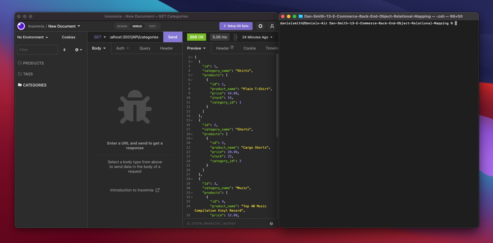

# Dan-Smith-13-E-Commerce-Back-End-Object-Relational-Mapping


**Description**
---

This application is a backend for an ecommerce store.
We can make various CRUD requests to our database with it.


**Set Up**
---

This Node JS application generates a 'Team Summary' website based on responses given by a user.

To start the program, first we need to install all dependencies by running: 

```
npm install
```

Once all dependencies have been installed, we need to establish our data base. You will need to login to mysql by using:

```
mysql -u username -p
```

After you enter your password we need to establish the database we will be working with by running:

```
source ./db/schema.sql
```

Now that our database exists it is time to populate it. We do this by using the command:

```
npm run seed
```

This will populate the database we created with data. Now that everything is done we can run our final command to start our server:

```
node server.js
```


**Video Demonstrations**
---

[](https://www.youtube.com/watch?v=oe_ALU50Y0M "Click here to watch the video!")

Click the image above or the link below to see the walkthrough video:

https://www.youtube.com/watch?v=oe_ALU50Y0M
